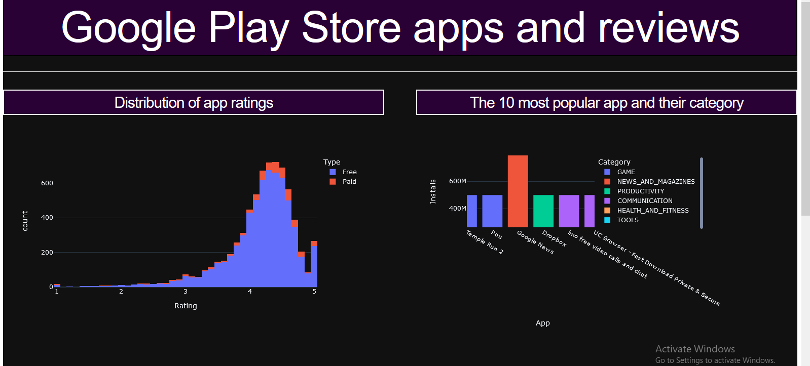

# Google Play Store apps analysis with simple dashboard

**Project Description:**

Mobile apps are everywhere. They are easy to create and can be lucrative.Because of these two factors, more and more apps are being developed. In this project,
I will do a comprehensive analysis of the Android app market by comparing over ten thousand apps in Google Play across different categories.
I'll look for insights in the data to devise strategies to drive growth and retention and finally I will make a dashboard to view this insights.

# The dashboard:

# Project Tasks:

1- Import Libraries

2- Load Data

3- Check Null Values

4- Data cleaning

5- Correcting data types

6- Distribution of app ratings

7- The 10 most popular app and their category

8- Relationship between the paid apps and its rating

9- Number of apps by category

10- Import CSS File

11- Create App Layout

12- Run the Server
